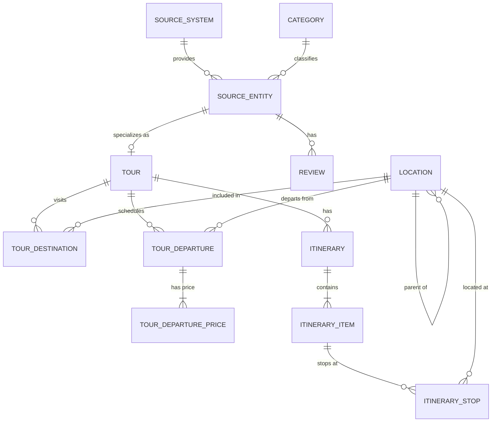

# NDS-ETL: Du Lịch & Khách Sạn (Normalized Data Store)

Hệ thống tích hợp và chuẩn hóa dữ liệu du lịch đa nguồn (Multi-source Travel Data Integration) vào kho dữ liệu chuẩn hóa **NDS (Normalized Data Store)** theo chuẩn quan hệ 3NF (Third Normal Form) trên nền tảng **PostgreSQL**.

---

## 1. Giới Thiệu Dự Án

Dự án **NDS-ETL** thu thập, làm sạch và tích hợp dữ liệu từ các nền tảng dịch vụ du lịch, lữ hành và khách sạn hàng đầu tại thị trường Việt Nam. Dữ liệu từ các nguồn thô phân tán với nhiều định dạng khác nhau (JSON phân cấp, Excel nhiều trang tính, CSV) được xử lý thông qua quy trình ETL và nạp vào cấu trúc cơ sở dữ liệu quan hệ chuẩn mực, phục vụ cho việc truy vấn phân tích, xây dựng Data Warehouse / Data Mart và khai phá dữ liệu.

---

## 2. Nguồn Dữ Liệu (Source Data)

Hệ thống tích hợp dữ liệu từ **7 nguồn lữ hành & lưu trú**:

| Nguồn | Định dạng gốc | Thực thể chính | Mô tả dữ liệu |
| :--- | :--- | :--- | :--- |
| **Agoda** | CSV, JSON | Khách sạn, Chuyến bay, Đánh giá | Dữ liệu phòng khách sạn, tiện nghi, điểm đánh giá và tóm tắt chuyến bay. |
| **BestPrice** | CSV | Tour, Khách sạn, Chuyến bay, Du thuyền, Review | Dữ liệu tổng hợp các dịch vụ du lịch, bảng giá và đánh giá người dùng. |
| **Ivivu** | CSV, XLSX | Khách sạn, Đánh giá | Dữ liệu thông tin khách sạn toàn quốc qua API và nhận xét của khách hàng. Có kèm từ điển dữ liệu. |
| **Klook** | CSV, XLSX | Tour / Hoạt động trải nghiệm, Review | Dữ liệu tour và đánh giá chi tiết trải nghiệm người dùng. |
| **Pystravel** | JSON, XLSX | Tour, Lịch trình chi tiết, Chính sách, Review | Dữ liệu tour du lịch chuyên sâu với cấu trúc phân cấp (lịch trình từng ngày, điều khoản, đánh giá). Có kèm từ điển dữ liệu. |
| **Saigontourist**| CSV, XLSX | Tour trọn gói, Lịch trình, Đánh giá | Dữ liệu tour lữ hành truyền thống, chương trình tour và đánh giá từ du khách. |
| **Vietravel** | XLSX | Tour, Bảng giá, Lịch khởi hành | Dữ liệu tour du lịch nội địa và quốc tế, metadata và danh mục hành trình. |

---

## 3. Kiến Trúc Mô Hình Dữ Liệu NDS (3NF Relational Model)

Cơ sở dữ liệu NDS được triển khai dưới schema `travel` trong PostgreSQL. Mô hình được thiết kế theo chuẩn 3NF nhằm loại bỏ dư thừa dữ liệu, đảm bảo tính toàn vẹn tham chiếu và dễ dàng mở rộng.

### Sơ đồ quan hệ thực thể (ERD):



### Các nhóm bảng chính trong schema `travel`:

1. **Quản lý Định danh & Nguồn dữ liệu (Core Entities)**:
   - `source_system`: Danh mục các hệ thống nguồn (`Agoda`, `BestPrice`, `Ivivu`, `Klook`, `Pystravel`, `Saigontourist`, `Vietravel`).
   - `category`: Phân loại dịch vụ (`Tour`, `Hotel`, `Flight`,...).
   - `source_entity`: Bảng thực thể trung tâm lưu trữ thông tin chung của từng bản ghi từ nguồn (`source_record_key`, `name`, `description`).

2. **Dữ liệu Tour & Lịch trình (Tour & Itinerary)**:
   - `tour`: Bảng con kế thừa `source_entity` lưu số ngày (`duration_days`), số đêm (`duration_nights`).
   - `location`: Quản lý địa danh/địa điểm với quan hệ cha-con (tỉnh/thành phố -> quận/huyện -> điểm du lịch).
   - `tour_destination`: Bảng liên kết M:N giữa Tour và các điểm đến (`location`).
   - `tour_departure`: Lịch khởi hành theo ngày và điểm xuất phát.
   - `tour_departure_price`: Lịch sử và chi tiết giá (giá niêm yết, giá khuyến mãi, chiết khấu, đơn vị tiền tệ).
   - `itinerary`: Quản lý chương trình tour.
   - `itinerary_item`: Chi tiết từng chặng/ngày trong hành trình (`day_start`, `day_end`, tiêu đề, mô tả).
   - `itinerary_stop`: Điểm dừng chân thực tế tại mỗi chặng (`location_id`, thứ tự dừng `stop_order`).

3. **Đánh giá Người dùng (Reviews)**:
   - `review`: Đánh giá của khách hàng cho từng thực thể (`rating_value`, `rating_scale`, nội dung, người đánh giá, thời gian).

---

## 4. Cấu Trúc Thư Mục Dự Án

```text
NDS-ETL/
├── data/                            # Landing Zone: Dữ liệu nguồn thô & từ điển dữ liệu
│   ├── Agoda/                       # Dữ liệu khách sạn và chuyến bay từ Agoda
│   ├── BestPrice/                   # Dữ liệu tour, hotel, flight, blog từ BestPrice
│   ├── Ivivu/                       # Dữ liệu khách sạn & từ điển dữ liệu từ Ivivu
│   ├── Klook/                       # Dữ liệu tour & review từ Klook
│   ├── Pystravel/                   # Dữ liệu tour phân cấp & từ điển dữ liệu Pystravel
│   ├── Saigontourist/               # Dữ liệu tour & review từ Saigontourist
│   └── Vietravel/                   # Dữ liệu tour & lịch trình từ Vietravel
├── sql/
│   └── travel_schema.sql            # Script DDL khởi tạo schema và bảng PostgreSQL NDS
├── .env.example                     # Mẫu cấu hình biến môi trường
├── .gitignore                       # Cấu hình loại bỏ file rác, cache, env
├── docker-compose.yml               # Cấu hình triển khai PostgreSQL và pgAdmin 4 bằng Docker
└── README.md                        # Tài liệu hướng dẫn dự án
```

---

## 5. Hướng Dẫn Cài Đặt & Sử Dụng

### Yêu cầu tiên quyết:
- **Docker & Docker Compose**
- **Python** 3.9+ (cho môi trường ETL)

### Bước 1: Khởi chạy Cơ sở dữ liệu với Docker Compose

Tạo file cấu hình môi trường `.env` từ file mẫu:
```bash
cp .env.example .env
```

Khởi chạy cụm dịch vụ PostgreSQL 16 và pgAdmin 4:
```bash
docker compose up -d
```

> [!TIP]
> Script DDL `sql/travel_schema.sql` đã được mount vào thư mục khởi tạo `/docker-entrypoint-initdb.d/`. Khi container PostgreSQL khởi chạy lần đầu tiên, toàn bộ schema `travel` và 12 bảng NDS sẽ được tự động tạo sẵn mà không cần chạy lệnh SQL thủ công.

- **PostgreSQL Connection**:
  - Host: `localhost`
  - Port: `5432`
  - Database: `nds_travel`
  - User: `postgres`
  - Password: `postgres`
- **pgAdmin 4 (Web UI)**:
  - URL: [http://localhost:8080](http://localhost:8080)
  - Email: `admin@nds.com`
  - Password: `admin`

Để kiểm tra trạng thái các container:
```bash
docker compose ps
```

Để dừng các dịch vụ:
```bash
docker compose down
```

### Bước 2: Chuẩn bị môi trường Python cho ETL
Tạo môi trường ảo và cài đặt các phụ thuộc cần thiết:

```bash
python3 -m venv .venv
source .venv/bin/activate
pip install pandas openpyxl sqlalchemy psycopg2-binary
```

---

## 6. Lộ Trình Triển Khai (Roadmap)

- [x] Tổ chức, phân tách và làm sạch thư mục `data/` theo từng nguồn.
- [x] Thiết kế mô hình dữ liệu quan hệ NDS chuẩn 3NF (`sql/travel_schema.sql`).
- [x] Khởi tạo Git repository và xây dựng tài liệu dự án (`README.md`).
- [ ] Xây dựng các module **Extractors** đọc dữ liệu đa định dạng (JSON, Excel, CSV).
- [ ] Xây dựng module **Transformer** làm sạch text tiếng Việt, chuẩn hóa ngày tháng, tiền tệ và bóc tách cấu trúc lồng.
- [ ] Xây dựng module **Loader** nạp dữ liệu vào PostgreSQL NDS đảm bảo ràng buộc toàn vẹn khóa ngoại (FK) và chống trùng lặp (Upsert / Deduplication).
