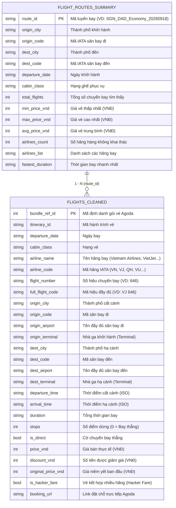

# Hệ Thống Thu Thập & Chuẩn Hóa Dữ Liệu Chuyến Bay Agoda (Flight Data Pipeline)

Dự án này là phân hệ thu thập (Crawl), bóc tách (Extract) và chuẩn hóa (Transform) dữ liệu chuyến bay nội địa từ API **Agoda Flights BFF** (`https://www.agoda.com/api/flights-bff/search/v1/flights`) phục vụ xây dựng kho dữ liệu **Data Warehouse**.

---

## 0. Hướng Dẫn Sử Dụng & Vận Hành

### Cập nhật Cookie phiên làm việc
Khi phiên làm việc hoặc cookie của Agoda hết hạn, cập nhật chuỗi cookie mới tại hằng số `COOKIE_STRING` trong file `flight_config.py`.

*Cách lấy cookie mới:*
1. Vào trang tìm kiếm chuyến bay Agoda (`https://www.agoda.com/flights`).
2. Mở Công cụ dành cho nhà phát triển (`F12` hoặc chuột phải -> **Inspect**).
3. Chuyển sang tab **Network** -> chọn lọc theo **Fetch/XHR**.
4. Thực hiện tìm kiếm 1 chuyến bay bất kỳ (ví dụ: SGN -> DAD).
5. Tìm request có tên `flights` -> Chuột phải -> **Copy** -> **Copy as cURL (bash)**.
6. Sao chép chuỗi `-b '...'` và cập nhật vào `COOKIE_STRING` trong `flight_config.py`.

### Lệnh chạy thu thập dữ liệu
```bash
# Di chuyển vào thư mục dự án
cd agoda_flights

# Cách 1: Chạy toàn bộ 42 chặng bay qua lại với cả 3 hạng vé (Economy, PremiumEconomy, Business):
python run_flight_crawler.py

# Cách 2: Chỉ cào riêng hạng vé Phổ thông (Economy) - chạy rất nhanh:
python run_flight_crawler.py --cabin Economy

# Cách 3: Chỉ định ngày bay tùy ý (mặc định: 2026-09-18):
python run_flight_crawler.py --date 2026-09-19

# Cách 4: Giới hạn số chặng bay (dùng để test nhanh):
python run_flight_crawler.py --limit 3
```

> **Lưu ý định dạng xuất file:**
> - Toàn bộ các file `.csv` đi kèm đều được lưu với mã hóa chuẩn `utf-8-sig` (UTF-8 with BOM), mở trực tiếp bằng Microsoft Excel trên Windows hiển thị tiếng Việt hoàn hảo, không bị lỗi font chữ.

---

## 1. Bản Đồ 11 Điểm Đến & Cửa Ngõ Sân Bay (Destinations - Airports Mapping)

Dữ liệu điểm đến được tích hợp trực tiếp từ danh mục **11 điểm đến du lịch hàng đầu tại Việt Nam** trong `AgodaTopDestinationsDemo.json`:

| STT | Tên Điểm Đến | Mã Thành Phố Agoda | Mã Sân Bay (IATA) | Tên Sân Bay Phục Vụ | Phân Loại Sân Bay |
| :---: | :--- | :---: | :---: | :--- | :--- |
| **1** | Ho Chi Minh City | 13170 | **SGN** | Tân Sơn Nhất International Airport | Sân bay quốc tế trực tiếp |
| **2** | Da Nang | 16440 | **DAD** | Đà Nẵng International Airport | Sân bay quốc tế trực tiếp |
| **3** | Hanoi | 2758 | **HAN** | Nội Bài International Airport | Sân bay quốc tế trực tiếp |
| **4** | Nha Trang | 2679 | **CXR** | Cam Ranh International Airport | Sân bay quốc tế trực tiếp |
| **5** | Dalat | 15932 | **DLI** | Liên Khương Airport | Sân bay nội địa trực tiếp |
| **6** | Phu Quoc Island | 17190 | **PQC** | Phú Quốc International Airport | Sân bay quốc tế trực tiếp |
| **7** | Hue | 17188 | **HUI** | Phú Bài International Airport | Sân bay quốc tế trực tiếp |
| **8** | Hoi An | 16531 | **DAD** | Sân bay Đà Nẵng (Gateway cách Hội An ~30km) | Cửa ngõ kết nối hàng không |
| **9** | Vung Tau | 17182 | **SGN** | Sân bay Tân Sơn Nhất (Gateway cách Vũng Tàu ~90km) | Cửa ngõ kết nối hàng không |
| **10** | Phan Thiet | 17180 | **CXR** / **SGN** | Sân bay Cam Ranh / Tân Sơn Nhất (đi cao tốc) | Cửa ngõ kết nối hàng không |
| **11** | Sapa | 17195 | **HAN** | Sân bay Nội Bài (sau đó đi cao tốc Lào Cai - Sapa) | Cửa ngõ kết nối hàng không |

* **Tổng số tuyến bay kết hợp:** 7 sân bay trực tiếp $\times$ 6 điểm đến đối ứng = **42 chặng bay hai chiều**.
* **Các hạng vé hỗ trợ:**
  1. `Economy` (Phổ thông)
  2. `PremiumEconomy` (Phổ thông đặc biệt)
  3. `Business` (Thương gia)

---

## 2. Sơ Đồ Thực Thể Quan Hệ (ERD)



---

## 3. Mô Tả Chi Tiết Từng File Dữ Liệu Kết Xuất

---

### 3.1. `flights_cleaned.json` & `flights_cleaned.csv` (Bảng Fact Chuyến Bay Chi Tiết)
- **Mục đích**: Chứa toàn bộ các lựa chọn chuyến bay thực tế tìm được từ Agoda cho từng chặng bay, lưu trữ từng bản ghi chi tiết phục vụ phân tích giá vé, giờ bay, thời gian bay và hãng hàng không.

| Tên thuộc tính | Kiểu dữ liệu | Mô tả chi tiết |
| :--- | :--- | :--- |
| `bundle_ref_id` | `int` | Mã số định danh duy nhất của gói vé trên hệ thống Agoda (**Primary Key**). |
| `itinerary_id` | `str` | Mã hành trình vé nội bộ của Agoda. |
| `departure_date` | `str` | Ngày khởi hành (Định dạng: `YYYY-MM-DD`). |
| `cabin_class` | `str` | Hạng vé phục vụ (`Economy`, `PremiumEconomy`, `Business`). |
| `airline_name` | `str` | Tên thương mại của hãng hàng không (Ví dụ: `Vietnam Airlines`, `VietJet Air`, `Bamboo Airways`, `Sun PhuQuoc Airways`). |
| `airline_code` | `str` | Mã định danh IATA của hãng hàng không (Ví dụ: `VN`, `VJ`, `QH`, `9G`). |
| `flight_number` | `str` | Số hiệu chuyến bay (Ví dụ: `646`, `1626`). |
| `full_flight_code` | `str` | Mã chuyến bay hoàn chỉnh ghép từ mã hãng và số hiệu (Ví dụ: `VJ 646`). |
| `origin_city` | `str` | Tên thành phố xuất phát (Ví dụ: `Ho Chi Minh City`, `Hanoi`). |
| `origin_code` | `str` | Mã IATA của sân bay xuất phát (Ví dụ: `SGN`, `HAN`, `DAD`). |
| `origin_airport` | `str` | Tên đầy đủ của sân bay xuất phát (Ví dụ: `Tan Son Nhat International Airport`). |
| `origin_terminal` | `str` | Tên nhà ga cất cánh (Ví dụ: `Terminal 1`). |
| `dest_city` | `str` | Tên thành phố điểm đến (Ví dụ: `Da Nang`, `Phu Quoc Island`). |
| `dest_code` | `str` | Mã IATA của sân bay điểm đến (Ví dụ: `DAD`, `PQC`). |
| `dest_airport` | `str` | Tên đầy đủ của sân bay hạ cánh. |
| `dest_terminal` | `str` | Tên nhà ga hạ cánh. |
| `departure_time` | `str` | Thời gian cất cánh chuẩn ISO (Ví dụ: `2026-09-18T20:40`). |
| `arrival_time` | `str` | Thời gian hạ cánh chuẩn ISO (Ví dụ: `2026-09-18T22:00`). |
| `duration` | `str` | Thời lượng bay hiển thị (Ví dụ: `1h 20m`, `2h 10m`). |
| `stops` | `int` | Số lượng điểm dừng trung chuyển (`0` = Bay thẳng). |
| `is_direct` | `bool` | Cờ xác định chuyến bay thẳng (`True`/`False`). |
| `price_vnd` | `int` | Giá vé sau giảm đã quy đổi sang VNĐ (Ví dụ: `1396666`). |
| `discount_vnd` | `int` | Số tiền giảm giá được Agoda áp dụng (VNĐ). |
| `original_price_vnd` | `int` | Giá gốc niêm yết trước khi áp dụng chiết khấu (VNĐ). |
| `is_hacker_fare` | `bool` | Vé tự ghép chuyến giữa các hãng khác nhau (`True`/`False`). |
| `booking_url` | `str` | Đường link dẫn thẳng tới trang đặt vé của Agoda. |

---

### 3.2. `flight_routes_summary.json` & `flight_routes_summary.csv` (Bảng Tuyến Bay Tổng Hợp)
- **Mục đích**: Tổng hợp nhanh dữ liệu theo từng cặp tuyến bay và từng hạng vé, giúp phục vụ phân tích so sánh giá vé rẻ nhất, đắt nhất, tần suất bay và các hãng đang khai thác.

| Tên thuộc tính | Kiểu dữ liệu | Mô tả chi tiết |
| :--- | :--- | :--- |
| `route_id` | `str` | Khóa chính tổng hợp tuyến bay (**Primary Key**, ví dụ: `SGN_DAD_Economy_20260918`). |
| `origin_city` | `str` | Tên thành phố khởi hành. |
| `origin_code` | `str` | Mã sân bay đi. |
| `dest_city` | `str` | Tên thành phố đến. |
| `dest_code` | `str` | Mã sân bay đến. |
| `departure_date` | `str` | Ngày bay được khảo sát. |
| `cabin_class` | `str` | Hạng vé khảo sát. |
| `total_flights` | `int` | Tổng số lượng chuyến bay tìm thấy trên trang 1. |
| `min_price_vnd` | `int` | Giá vé rẻ nhất trên tuyến bay này (VNĐ). |
| `max_price_vnd` | `int` | Giá vé đắt nhất trên tuyến bay này (VNĐ). |
| `avg_price_vnd` | `int` | Giá vé trung bình trên tuyến bay này (VNĐ). |
| `airlines_count` | `int` | Số lượng hãng hàng không đang khai thác chặng này. |
| `airlines_list` | `str` | Danh sách tên các hãng hàng không tham gia khai thác. |
| `fastest_duration` | `str` | Thời gian bay ngắn nhất của chặng bay này. |

---

## 4. Bản Đồ File Mã Nguồn Python

| Tên file Python | Trách nhiệm trong hệ thống | File đầu ra tương ứng |
| :--- | :--- | :--- |
| `flight_config.py` | Cấu hình tập trung: Chứa API Endpoint, Cookie, Headers và Bản đồ 11 điểm đến - Sân bay. | *(Cấu hình)* |
| `agoda_flight_crawler.py` | Engine bóc tách dữ liệu: Gửi request tới BFF API, parse thông tin vé, lọc dữ liệu. | `flights_cleaned.json`<br>`flights_cleaned.csv` |
| `run_flight_crawler.py` | Bộ điều phối CLI: Quản lý tham số dòng lệnh (`--date`, `--cabin`, `--limit`, `--delay`). | `flight_routes_summary.json`<br>`flight_routes_summary.csv` |
